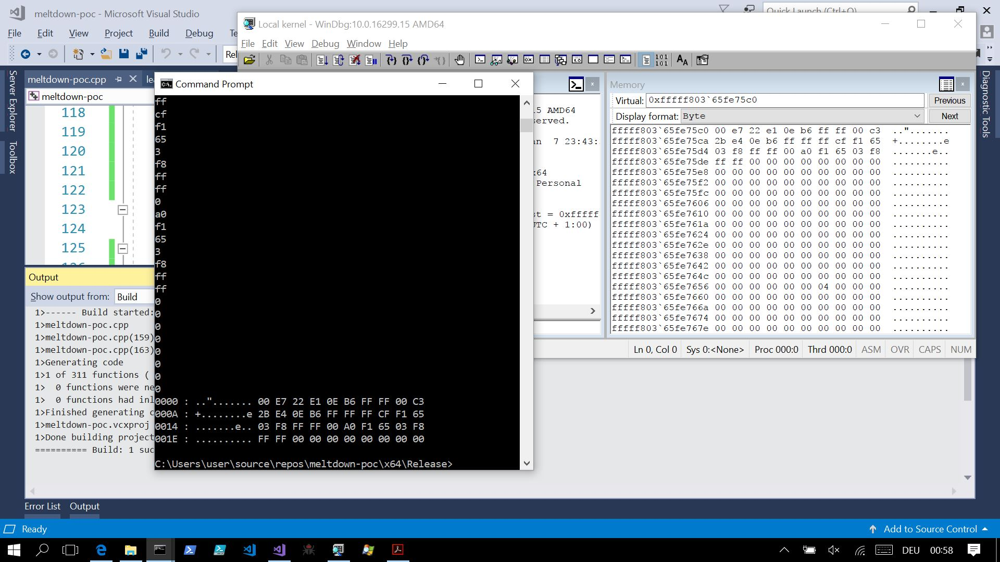

# meltdown-poc
A PoC implementation of the meltdown attack described in https://meltdownattack.com/meltdown.pdf

This implementation was testet on Windows 10 (`10.0.15063.0`) on Intel Atom x5-Z8350 hardware.

It is likely that it needs some tweaking to run properly on other platforms.

So far only some specific kernel memory could be leaked, it worked with the page containing PsLoadedModuleList very well, with the kernel base address not so well.

